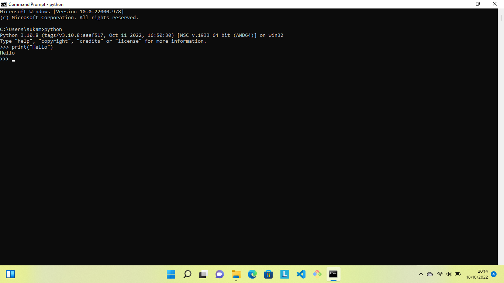
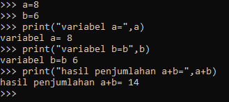
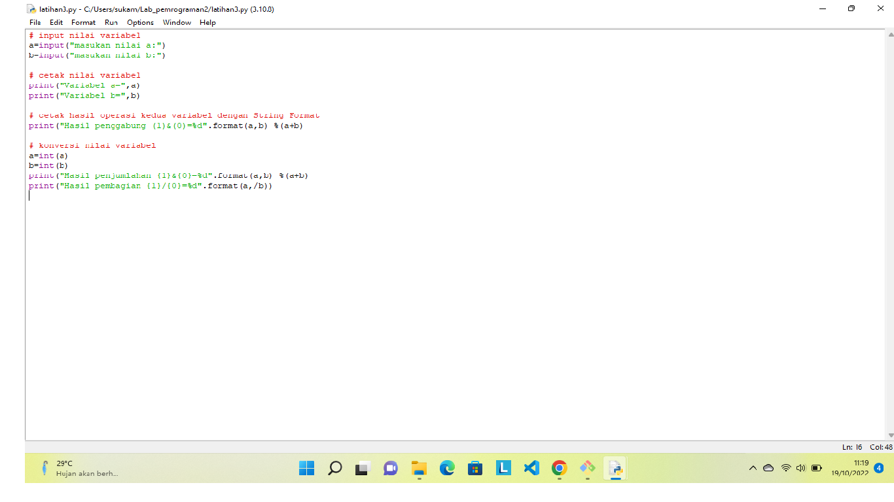
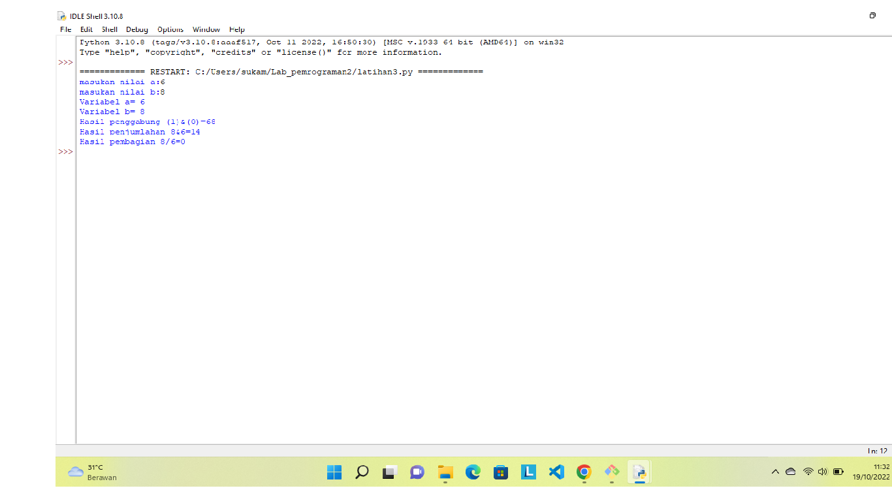

 # Latihan 1
 
 ### - Menjalankan Python Console
#### - Menampilkan tulisan"Hello"dilayar
#### - Menampilkan tulisan"Saya sedang belajar python"dilayar

# Latihan 2
### - Menjumlahkan dua buah bilangan menggunakan variabel a dan b
#### - Mendefinisikan variabel a dengan nilai 8
#### - Mendefinisikan variabel b dengan nilain 6
#### - mencetak variabel a dan b
#### - mencetak hasil penjumlahan a+b

# Latihan 3
### Menjalankan IDLE
#### - membuat file baru dengan nama latihan3.py(patikan lokasi file pada folder lab2py pada direktori kerja andaa)
#### - menggunakan fungsi input untuk mengambil nilai variabel dari keybord

